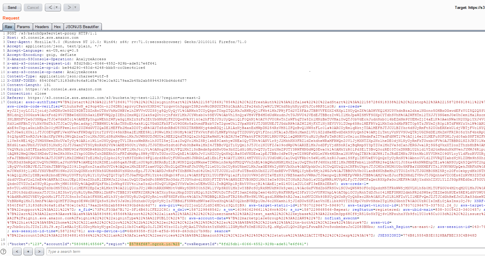
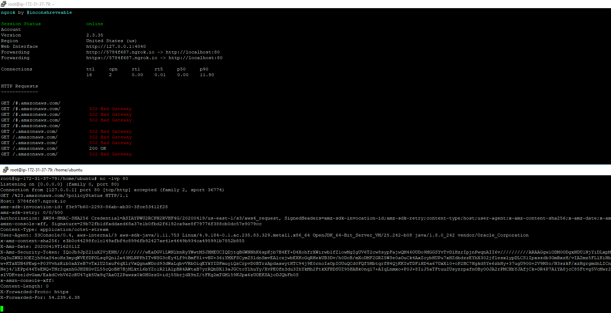
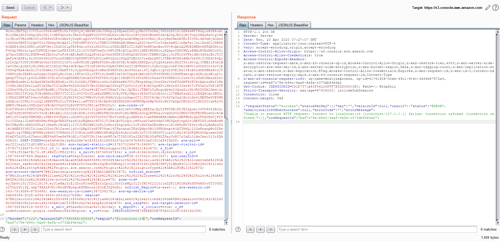
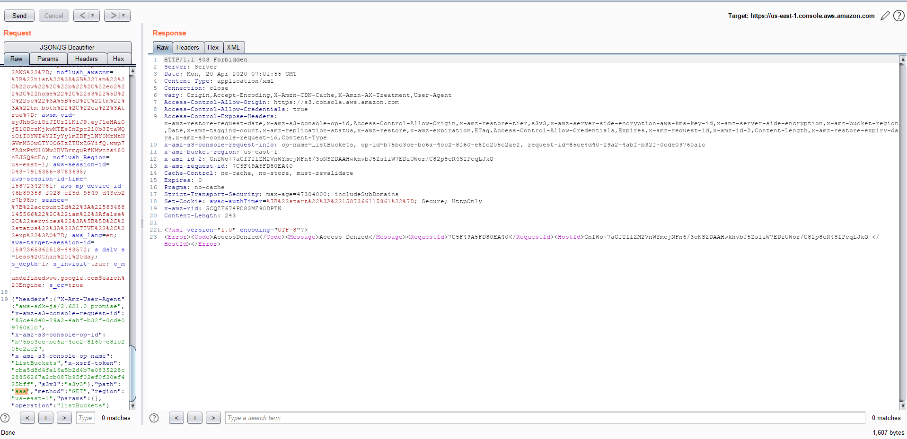
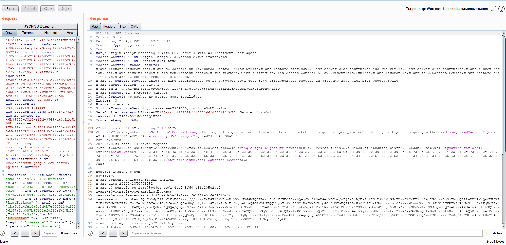
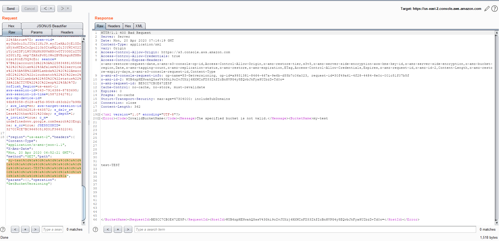

# Multiple vulnerabilities in Amazon Web Services

## 1st is CWE-918: Server-Side Request Forgery (SSRF).
It is possible in https://s3.console.aws.amazon.com/s3/batchOpsServlet-proxy when sending POST-request. 
Vulnerable parameter is "region"  in JSON string of POST data. 

and request from Amazon server:

(Header "x-amzn-console-xff" and ngrok account name was hidden)

We can replace valid value (us-east-1,eu-west-1 or any other) to our payload and 2 special characters for bypass concatenating other strings (".s3", ."amazonaws.com/" and name of bucket)  to our payload . We need add "@" in start of our payload and "/" in end of our payload(for example: "@example-domain.com/"). It allows us to exploiting SSRF vulnerability. 
For example 2 requests for scan local ports:

Closed port

Open port

## 2nd is CWE-209: Generation of Error Message Containing Sensitive Information (Information disclosure).

It is possible in https://us-east-1.console.aws.amazon.com/s3/proxy when sending POST-request. Vulnerable parameter is "path" in JSON string of POST data. We can replace valid value "aaa" to URL-encoded data of valid value - "%61%61%61". It allows us to get sensitive information about request from server (all headers, url, cookie, temporary aws_access_key_id, aws_security_token, version of software on server).

[Full response](full.txt)

## 3rd is CWE-144: Improper Neutralization of Line Delimiters (CRLF).

It is possible in https://us-east-2.console.aws.amazon.com/s3/proxy when sending POST-request. Vulnerable parameter is "path" in JSON string of POST data. We can insert to parameter "path" special characters "%0d%0a". It allows us to use CRLF injection.

- 20.04.2020 - Reported to https://aws.amazon.com/security/
- 06.05.2020 - Patch 

